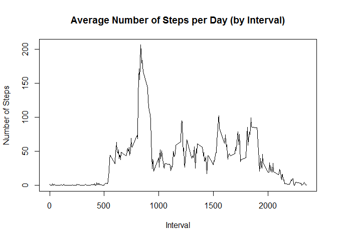

# Analyzing FitBit Data
Khawar Siddiqui  
3 DEC 2016  
### Analysis of Data from Personal Activity Monitoring Device (FitBit)
This document attempts to answer questions in the light of analysis of data collected by a Personal Monitoring Device [FitBit](http://en.wikipedia.org/wiki/Fitbit).
This is the first project for the **Reproducible Research** course in Coursera's Data Science specialization track. 

## The Assignment
The assignment was meant to serve as a hands on training in: 

* loading and pre-processing a data set using R or R-Studio
* imputing missing values in the data set
* interpreting the results and answer research questions

## About The Data
The data for this assignment was downloaded from:

* **Dataset**: Personal Activity Monitoring data from Dataset: [Activity monitoring data](https://d396qusza40orc.cloudfront.net/repdata%2Fdata%2Factivity.zip) [52K]. The data was in the form of a .csv file archived as a zip file. The variables of dataset are as below:

* **steps**: Number of steps walked in a 5-minute interval (missing values are coded as `NA`)

* **date**: The date on which the measurement was taken in YYYY-MM-DD format

* **interval**: Identifier for the 5-minute interval in which
    measurement was taken

The dataset is stored in a comma-separated-value (CSV) file and there are a total of 17,568 observations in this dataset.

## Loading and pre-processing the data for analysis

The data was loaded into a data frame `actMonData_00` after loading the two libraries. 


```r
library(ggplot2)
library(lattice)
library(knitr)

# Loading and Processing 
if(!file.exists("getdata-projectfiles-UCI HAR Dataset.zip")) {
        temp <- tempfile()
        download.file("http://d396qusza40orc.cloudfront.net/repdata%2Fdata%2Factivity.zip",temp)
        unzip(temp)
        unlink(temp)
}


actMonData_00<-read.csv("activity.csv")
```

## What is mean total number of steps taken per day?

Totalling the steps taken by day, making histogram, and then calculating the mean and the median.

```r
	# Mean and Median Number of Total Steps Per Day
	stepsPerDay <- aggregate(steps ~ date, data=actMonData_00, sum, na.rm = TRUE)
	hist(stepsPerDay$steps, breaks=25, main = paste("Total Steps Per Day"), col="red", xlab="Steps Taken", ylab="Frequency")
```

<!-- -->

```r
	mean_stepsPerDay <- mean(stepsPerDay$steps)
	median_stepsPerDay <- median(stepsPerDay$steps)
	print(paste("The mean steps per day is: ", mean_stepsPerDay))
```

```
## [1] "The mean steps per day is:  10766.1886792453"
```

```r
	print(paste("The median steps per day is: ", median_stepsPerDay))
```

```
## [1] "The median steps per day is:  10765"
```

## What is the average daily activity pattern?

1 Calculate average steps for each interval for all days. 
2 Plot the Average Number Steps per Day by Interval. 
3 Find interval with most average steps. 

```r
	stepsPerInterval <- aggregate(steps ~ interval, actMonData_00, mean)
	plot(stepsPerInterval$interval,stepsPerInterval$steps, type="l", xlab="Interval", ylab="Number of Steps",main="Average Number of Steps per Day (by Interval)")
```

<!-- -->

```r
	intervalWithMaxSteps <- stepsPerInterval[which.max(stepsPerInterval$steps),1]
	print(paste("Time Interval with Maximum Steps: ", intervalWithMaxSteps))
```

```
## [1] "Time Interval with Maximum Steps:  835"
```

## Imputing the missing values. 
## Comparing the imputed with non-imputed data.

There were numerous missing values in the data set. The missing values were imputed using the median as the data might not be normal.  

```r
	# Impute missing values. Compare imputed to non-imputed data.
	missings <- sum(is.na(actMonData_00$steps))
	print(paste("There are", missings, "missing data points."))
```

```
## [1] "There are 2304 missing data points."
```

```r
	imputedData <- actMonData_00
	imputedData$steps[is.na(imputedData$steps)] <- median(actMonData_00$steps, na.rm=TRUE)
	imputedDataday <- aggregate(steps ~ date, data=imputedData, sum, na.rm=TRUE)
	hist(imputedDataday$steps, breaks=20, main="Total Steps per Day \n Using Imputation Adjustment with Median",
		 xlab="Steps", ylab="Frequency")
```

<!-- -->

```r
	imputedMean <- mean(imputedData$steps)
	imputedMedian <- median(imputedData$steps)
	print(paste("The mean is: ", imputedMean))
```

```
## [1] "The mean is:  32.4799635701275"
```

```r
	print(paste("The median is: ", imputedMedian))
```

```
## [1] "The median is:  0"
```

```r
	meanDifference<- imputedMean-mean_stepsPerDay
	medianDifference <- imputedMedian-median_stepsPerDay
	print(paste("The difference between the imputed and original mean is: ", meanDifference))
```

```
## [1] "The difference between the imputed and original mean is:  -10733.7087156752"
```

```r
	print(paste("The difference between the imputed median and the original median is: ", medianDifference))
```

```
## [1] "The difference between the imputed median and the original median is:  -10765"
```

## Visualizing differences in activity patterns between weekdays and weekends? 

Below is a plot to compare the number of steps counted between the week and weekend. As it is evident from the graph, there is a higher activity in earlier hours on weekdays, and the weekends are showings an active person throughout the day.  

```r
	imputedData$date <- as.Date(imputedData$date)
	imputedData$dayOfTheWeek <- weekdays(imputedData$date)
	imputedData$weekend <- as.factor(ifelse(imputedData$dayOfTheWeek == "Saturday" |
											 imputedData$dayOfTheWeek == "Sunday", "Weekends", "Weekdays"))
	plotdata <- aggregate(steps ~ interval + weekend, imputedData, mean)
	library(lattice)
	xyplot(steps ~ interval | factor(weekend), data=plotdata, aspect=1/3, xlab="Time Interval", ylab="Steps Taken", layout=c(1,2), type="l",)
```

<!-- -->
